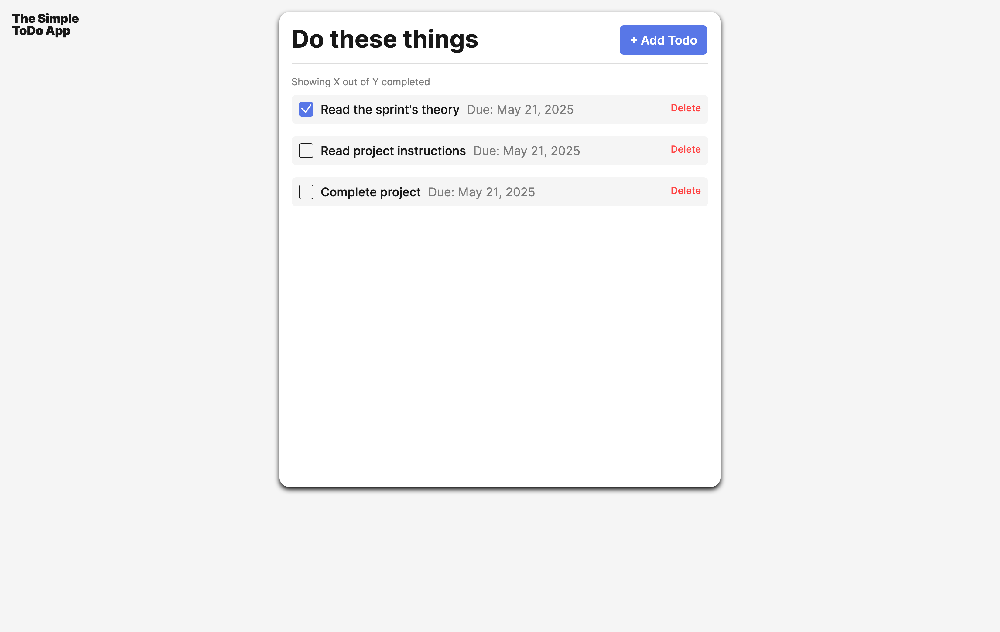
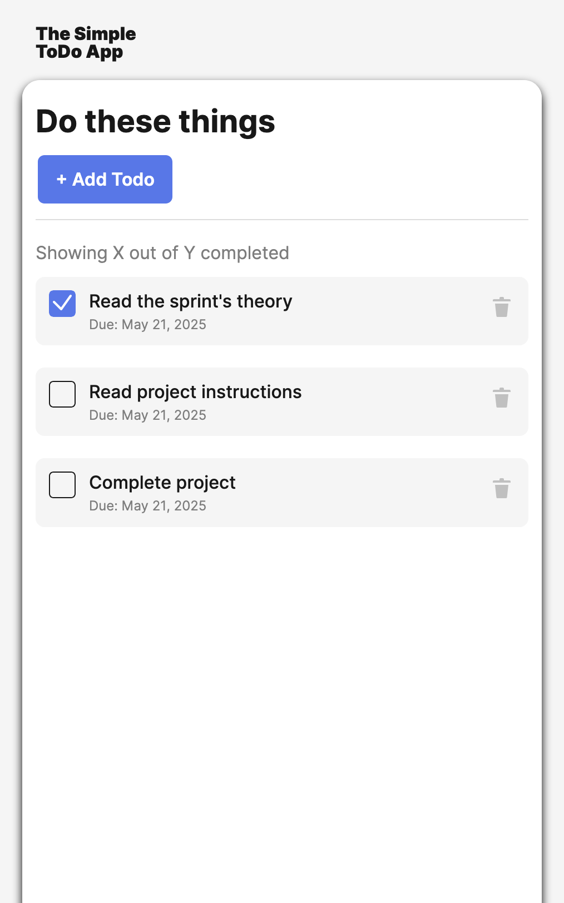
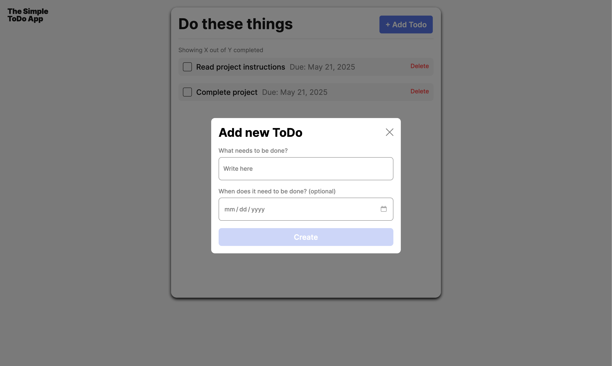
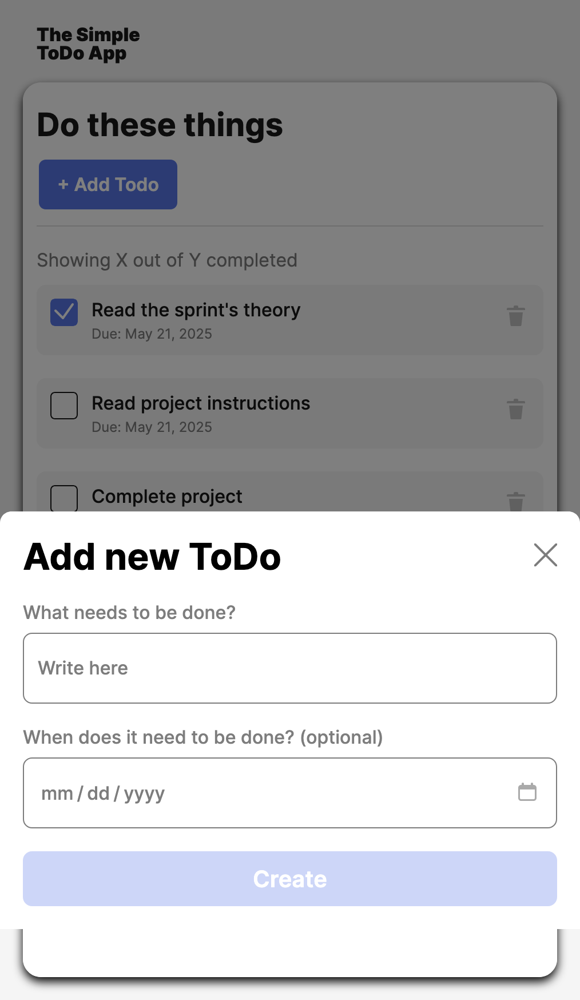

# Simple Todo App

This to-do application allows you to create tasks with due dates. This application allows you to check tasks that have been completed and also allows the deletion of tasks.

## Functionality

This to-do application features validation when entering a new task, requiring at least 2 letters be entered before accepting a result. This application allows the deletion of created tasks, and also allows the user to check off tasks to indicate their completion.

## Technology

This application was created using HTML, CSS, and Javscript. The technologies used for Javascript include encapsulation, which is the usage of private/public classes for easy access, ES6+ features such as arrow functions, default & named exports, and template literals, querying and manipulating DOM elements, and splitting the code into modules to accomplish a modular Javascript structure.

Default Desktop View:

Default Mobile View:

Desktop View Add Task Modal:

Mobile View Add Task Modal:

## Deployment

This project is deployed on GitHub Pages:

- ADD LINK HERE
